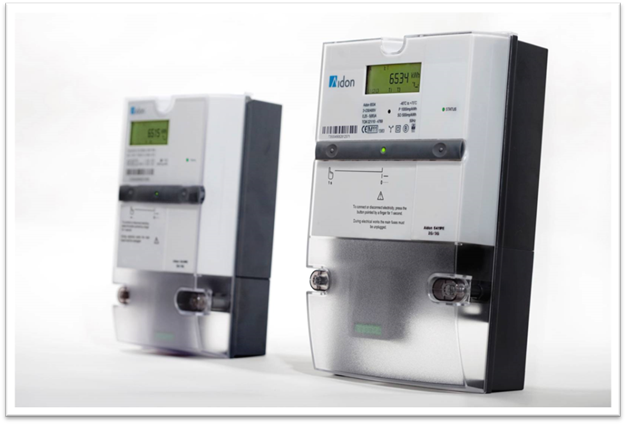
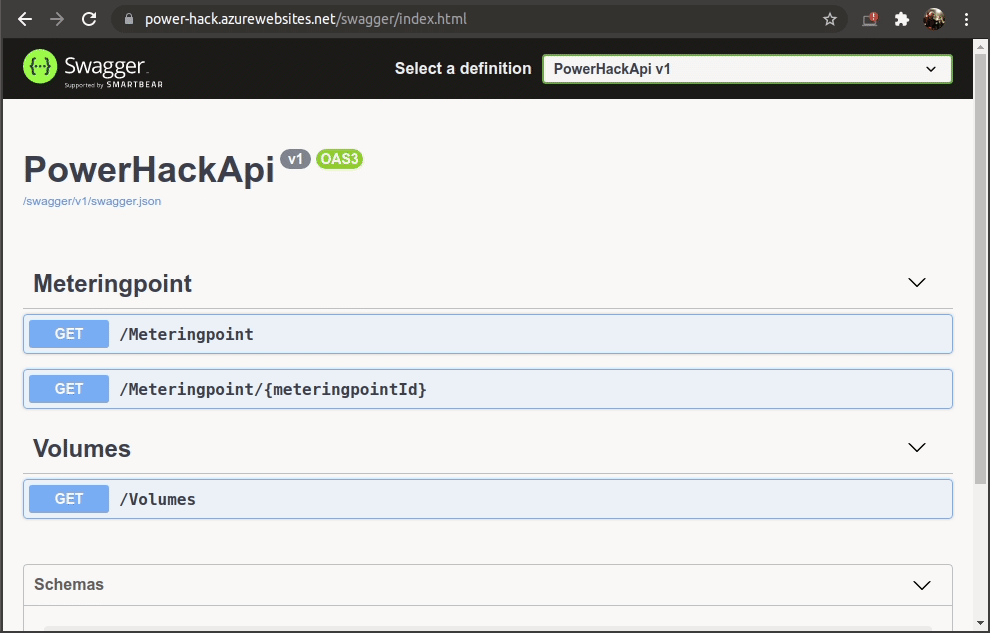

# Power-Hack ⚡⛏️

I de siste tiår har utviklingen i internett og digitale teknologier ført til store omveltninger i flere bransjer. Nå står kraftbransjen midt oppe i denne omveltningen, med de utfordringene og mulighetene det fører med seg. For Elvia er det svært viktig å følge med og være med på denne utviklingen.

Smarte strømmålere representerer et viktig ledd i denne digitaliseringen, og finnes nå i alle norske hjem. Først og fremst er målerne sett på som et verktøy for automatisk avregning og avlesning av strømforbruk, men mulighetene er mye større enn som så.

I dette hackatonet ønsker Elvia og Computas å bli inspirert av studenter, ved å gi dem anledning til å utvikle et produkt eller en løsning, som benytter seg av data fra smarte strømmålere.

Dere velger selv hvilken målgruppe produktet/løsningen skal være for. Dette kan f.eks. være forbrukere, nettselskaper eller strømselskaper.

## Datakilder

Dere skal lage et produkt eller en løsning som drar nytte av data fra de nye AMS-målerne. Dere står fritt til å kombinere data fra AMS-målere med andre datakilder.

### API for AMS-målere

De nye AMS-målerne registrerer og innrapporterer strømforbruket ditt til nettselskapet, helt ned på timenivå. Via et API kan du få tilgang til (nesten) ekte data fra et utvalg av målerne i Elvia. Her kan du få en liste av tilgjengelige målere og diverse info om dem. Hver av målerne har en ID (meteringpointId), som man kan bruke til å hente ut historiske timesmålinger fra April 2019 fram til August 2021.

API'et er beskrevet [her](https://power-hack.azurewebsites.net/swagger/index.html) i Swagger UI. Her kan man teste ut API'et, se hvilke endepunkter som er tilgjenelig, hva slags inpput parametre som forventes, og hvordan datamodellen ser ut. Ta en titt på seksjonen "Kort om bruk av Swagger UI", hvis du lurer mer på hvordan man bruker Swagger UI.

#### HAN-port og SignalR

De nye AMS-målerne har også en [HAN-port](https://www.elvia.no/smart-forbruk/alt-om-din-strommaler/dette-er-han-porten/), som man kan be om å få åpnet. Data herfra kan for eksempel brukes til å optimalisere smarthjem løsninger eller overvåke ditt eget strømforbruk gir. Når porten er åpnet får du tilgang til forbruksdata og detaljert informasjon om blandt annet strømforbruk i sanntid (real time) og strømforbruket siste timen.

For å simulere HAN-porten til strømmålerne, tilbyr API'et også et [SignalR](https://docs.microsoft.com/en-us/aspnet/core/signalr/introduction?WT.mc_id=dotnet-35129-website&view=aspnetcore-5.0)-endepunkt, som hvert andre sekund sender ut verdier om
- Forbruk i øyeblikket (Watt)
- Forbruk så langt siden siste timeskift (kwh)
- Tid for målingen
- MålepunktsId

Her er eksempel for hvordan man kan koble seg til signalR-streamen C#:
```csharp
using System;
using System.Threading;
using Microsoft.AspNetCore.SignalR.Client;

var hubConnection = new HubConnectionBuilder()
    .WithUrl("https://power-hack.azurewebsites.net/liveMeasurement")
    .Build();

await hubConnection.StartAsync();

// Replace <MeteringpointId>
var stream = hubConnection.StreamAsync<object>("Subscribe", <MeteringpointId>);

await foreach (var liveMeasurement in stream)
{
    Console.WriteLine(liveMeasurement);
}
```

Og i javascript:
```js
const signalR = require("@microsoft/signalr")

const connection = new signalR.HubConnectionBuilder()
    .withUrl("https://power-hack.azurewebsites.net/liveMeasurement")
    .configureLogging(signalR.LogLevel.Information)
    .build();

async function start() {
    try {
        await connection.start();
        console.log("SignalR Connected.");

        // Replace <MeteringpointId>
        connection.stream("Subscribe", <MeteringpointId>).subscribe({
            next: (item) => console.log(item),
            complete: () => console.log("stream completed"),
            error: (err) => console.log(err)
        })
    } catch (err) {
        console.log(err);
        setTimeout(start, 5000);
    }
};

start()
```


### Andre datakilder og nyttige linker
Under er en samling nyttige lenker, og andre datakilder, man kan kombinere med dataene fra AMS-måler API'et:
- [Swagger for målere og historisk strømforbruk for disse](https://power-hack.azurewebsites.net/swagger/index.html)
- [Dokumentasjon for SignalR](https://docs.microsoft.com/en-us/aspnet/core/signalr/introduction?WT.mc_id=dotnet-35129-website&view=aspnetcore-5.0), [.NET Client](https://docs.microsoft.com/en-us/aspnet/core/signalr/dotnet-client?view=aspnetcore-5.0&tabs=visual-studio), [JavaScript client](https://docs.microsoft.com/en-us/aspnet/core/signalr/javascript-client?view=aspnetcore-5.0)
- [Strømpriser 2019-2021 i csv format](Strømpriser/)
  - [2019](Strømpriser/Day-ahead%20Prices_201901010000-202001010000.csv)
  - [2020](Strømpriser/Day-ahead%20Prices_202001010000-202101010000.csv)
  - [2021](Strømpriser/Day-ahead%20Prices_202101010000-202201010000.csv)
- [Strømpriser](https://transparency.entsoe.eu/transmission-domain/r2/dayAheadPrices/show) European Network of Transmission System Operators for Electricity
- [Vær-data i Elvia området](https://elvia.portal.azure-api.net/) Historiske vær-meldinger, observasjoner og lyn-data. (legg til subscribtion til WeatherIngestApi)
- [Mer vær-data](https://frost.met.no/index.html) fra Meteorologisk institutt


## Kort om strømmålere og målepunkter
I dette caset, har vi valgt å fokusere på data fra de nye AMS-målerne. Dette er automatiske strømmålere som står utplassert hos alle kundene til Elvia, og de andre nettselskapene i Norge.

AMS-målerne sender automatisk inn målerstanden til Elvia, på faste tidspunkt. Målerstanden viser hvor mye strøm som er blitt brukt (eller produsert), siden måleren ble installert. Basert på flere målerstander, kan man regne ut et volum, som forteller oss hvor mye strøm som har blitt brukt i en spesiell tidsperiode. Hvis f.eks. målerstanden var på 2 kWh (kilowattimer) for 24 timer siden, og den er 3 kWh nå, vet vi at det er brukt 3 - 2 = 1 kWh det siste døgnet. Vi har valgt å gi dere ferdig beregnede volumer i API'et vi stiller med.



Hvor ofte AMS-målerne sender inn målerstander, er styrt via konfigurasjon på hver måler. Ofte er det flere forskjellige konfigurasjoner, avhengig av hva standene, og de beregnede volumene, skal brukes til. I vårt eksempel er denne konfigurasjonen satt opp under leveranseprofil (delivery profile).

### Målepunkter
Over tid, blir gjerne måleren byttet flere ganger. Det kan være at man fikk installert en automatisk avlest måler, at en gammel måler ble ødelagt, eller at man har oppgradert el-anlegget på en måte som gjør at man trenger en annen måler. For å vise at alle målerne var installert samme sted, jobber man derfor ofte med målepunkter i stede for selve målerne. Et målepunkt er med andre ord et sted hvor en måler er installert.

Ved å se på målepunktet, kan man få mer informasjon om stedet måleren er installert. I [API'et med målere og historisk strømforbruk for disse](https://power-hack.azurewebsites.net/swagger/index.html), har vi blant annet tatt med hvor målepunktet er plassert (latitude/longitude), og hvilke type kunde som er knyttet til målepunktet (consumptionCode/businessSector).


## Kort om bruk av Swagger UI
[Swagger UI](https://swagger.io/tools/swagger-ui/) er et verktøy som lar utviklere utforske API i nettleseren. Verktøyet lar utviklere teste ut forskjellige kall mot API'et, og utforske dataene som API'et returnerer.


I tillegg viser Swagger UI dokumentasjon av de forskjellige datatypene API'et returnerer. Man kan f.eks. få oversikt over hva ulike datafelter betyr, hvilke type verdier de inneholder, og mye mer. Det kan være verdt å bruke litt tid på å se på dataene i Swagger UI, når man vurderer hvilket type løsning man skal lage.


